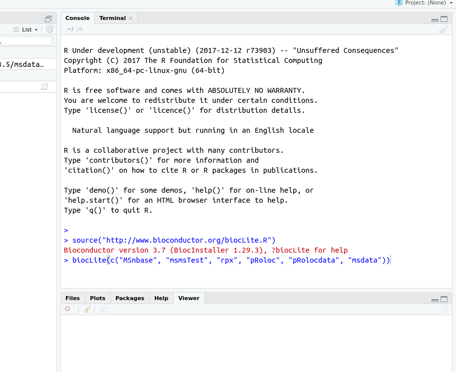

## R and Bioconductor for proteomics at the Sainsbury Laboratory 


This repository will host the OpenPlant funded *R/Bioconductor for
proteomics* material. The funding was awarded to Jan Sklenar (TSL,
Norwich), Laurent Gatto (UCam), Marielle Vigouroux (JIC), Govind
Chandra (JIC) to introduce and implement the utilisation of
various
[R for proteomics](https://www.bioconductor.org/packages/release/data/experiment/html/RforProteomics.html) tools
in the Sainsbury Laboratory and more generally on the Norwich campus.

The project will run 6 sessions/days over 6 months with the aim to

- Identify needs and opportunities
- Train invdividuals
- Dedicated development and integration with existing tools

## Session 1: Setting the stage (15 Jan 2018)

- Introductory talk: [R and Bioconductor for proteomics](https://rawgit.com/lgatto/2018_01_15_TSL_Norwich/master/rfp.html)

During this session, we discussed the concrete needs and opportunities
that would be tackled as part of this project, and set a schedule for
the sessions until June.

## Session 2: Hands-on introduction to R and Bioconductor for proteomcs (2 Feb 2018)

### Software requirements: R and RStudio

Download and install [R](http://mirrors.ebi.ac.uk/CRAN/)
and [RStudio](https://www.rstudio.com/products/RStudio/). In case you
already have R installed, make you have R 3.4.3. To check the version:

```r
> version
               _                                          
platform       x86_64-pc-linux-gnu                        
arch           x86_64                                     
os             linux-gnu                                  
system         x86_64, linux-gnu                          
status         Patched                                    
major          3                                          
minor          4.3                                        
year           2017                                       
month          12                                         
day            12                                         
svn rev        73903                                      
language       R                                          
version.string R version 3.4.3 Patched (2017-12-12 r73903)
nickname       Kite-Eating Tree
```

Once the software are installed, open RStudio and install Bioconcuctor
packages:

```r
source("http://www.bioconductor.org/biocLite.R")
biocLite(c("MSnbase", "msmsTests", "rpx", "pRoloc", "pRolocdata", "msdata"))
```



To test the installation, load `MSnbase`:

```r
library("MSnbase")
```

### Programme

- Introduction to R and RStudio and Bioconductor
- R documentation and vignettes
- Variables, vectors and dataframes
- Manipulating data
- Plotting
- Saving and loading data (binary and csv)
- Installing packages
